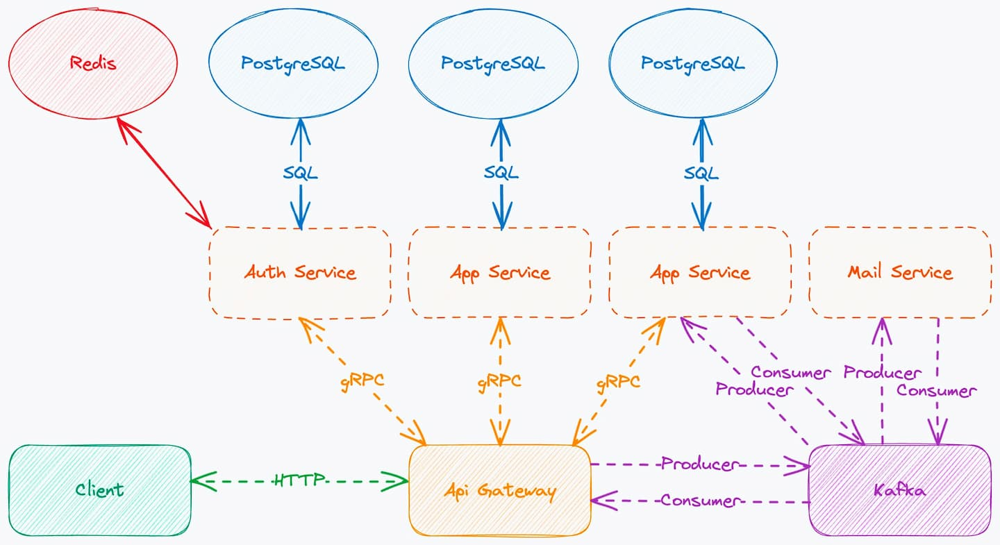

# GOStat - Open Source Statistics Service

**Note**: This project is created to showcase my proficiency in frontend and backend development.

Welcome to GOStat, a cutting-edge microservice-based application designed to handle HTTP request authentication and statistics with finesse. This project comprises several key microservices, each contributing to its overall functionality and prowess:

- **api_service**: Serving as the gateway for HTTP requests, this microservice orchestrates communication with other components.
- **auth_service**: This microservice is your go-to for authentication tasks, ensuring secure access.
- **stat_service**: Providing robust statistical functionality, this microservice empowers your data-driven insights.
- **app_service**: Seamlessly manage your applications with this dedicated microservice.
- **mail_service**: Need to send emails? Look no further, as this microservice has you covered.
- **client_service**: The frontend, built with next.js, offers an engaging user interface.

All of these microservices are crafted using GoLang. For synchronous communication, they utilize the powerful `gRPC` protocol, while for asynchronous messaging, they leverage `Kafka`. Additionally, they harness the capabilities of the `GORM` ORM library to interact with a `PostgreSQL` database, ensuring data integrity and efficiency.




## Technologies

- **Langs**: GoLang / TypeScript
- **Web Server**: Gin
- **Front-end**: NextJs
- **In-Memory Data Store / Caching**: Redis
- **Database**: PostgreSQL
- **ORM**: GORM
- **Microservice** Communication: 
  - **gRPC**: for synchronous communication
  - **Kafka**:for asynchronous communication
- **CI/CD**: GitHub Actions
- **Containerization**: Docker / Docker Compose

## Project Goals

GOStat is developed with several key objectives in mind:

- **Demonstrate Expertise**: This project serves as a testament to my skills in both frontend and backend development, showcasing my ability to create a seamless and robust application.
- **Microservices Architecture**: By adopting a microservices architecture, GOStat aims to illustrate the advantages of modularity and scalability in modern application design.
- **Cutting-Edge Technologies**: GOStat leverages the latest technologies, such as GoLang, TypeScript, and Docker, to provide a state-of-the-art solution for handling HTTP requests and statistics.

## Get Involved

You can actively contribute to the GOStat project by sharing your ideas and feedback. Feel free to propose new features, report issues, or suggest improvements by creating GitHub issues. I value your input and are excited to collaborate with the community to make GOStat even better.

## Prerequisites

To run GOStat on your local machine (macOS/Linux), you'll need to have the following tools and technologies installed:

Docker / Docker Compose

## Getting Started

To get GOStat up and running, follow these simple steps:

### Starting the Services

Open your terminal and run the following command to start the services:

```sh
make start
```

### Stopping the Services

When you're done, stop the services by running the following command:

```sh
make stop
```

With GOStat, you have a powerful and comprehensive solution at your fingertips, showcasing the synergy of frontend and backend development expertise. Enjoy exploring the world of GOStat!

Don't forget to show your support by starring this repository—it means a lot to me. 

Special thanks to our talented [designer](https://www.behance.net/taisia_pro) for their exceptional design contributions.
